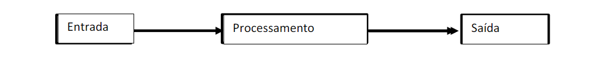
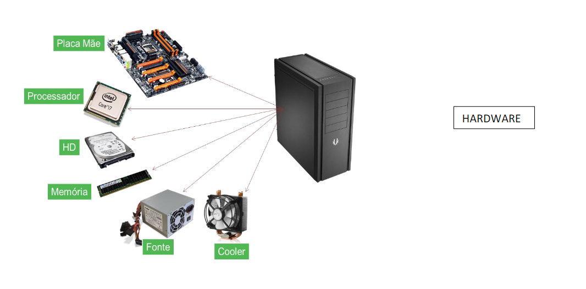

> Um computador, também chamado de `Sistema Eletrônico de Processamento  de Dados` é um **conjunto de componentes físicos (hardware) e abstratos ou lógicos (software), cujo propósito é realizar manipulação de elementos**, que são atualmente denominados de dados. **Esta manipulação é realizada de forma logicamente encadeada**, conforme o que se deseja obter com a referida manipulação.
> 

Os termos dado e informação podem ser tratados como sinônimos ou como termos distintos; dado pode ser definido como a matéria-prima originalmente obtida de uma ou mais fontes (etapa de coleta), e informação como o resultado  do  processamento,  isto  é, o  dado  processado ou  “acabado”.

**Informação subentende dados organizados** (segundo um arranjo ou programação específica ou, em outras palavras, segundo uma ordenação logicamente encadeada) **para o atendimento ou emprego de uma pessoa ou grupo que os recebe.**

1. Entrada (coleta de dados)
2. Processamento (processa os dados para eles virarem informação)
3. Saída (exibe a informação)

O  conjunto  dessas  etapas, o  passo  a  passo  para  calcular  a  média  final  é  denominado  em  Informática  (em processamento de dados)  de  um  **algoritmo**.

As mencionadas etapas são:

- Buscar uma nota (entrada do dado),
- Somar com o valor existente - se for a 1ª nota, o valor existente é igual a zero (processamento);
- Buscar outra nota (enquanto houver notas), somar com novo valor existente;
- Acrescentar um ao contador de alunos (para se obter o divisor final-total de alunos) e
- Assim, o resultado (saída) vai sendo sucessivamente aumentado com as novas somas;
- .Ao obter e somar a última nota, efetua-se a divisão.

A execução desse conjunto de etapas (algoritmo) caracteriza a atividade de processamento.

Então, o processamento não é uma única atividade, mas sim um conjunto de atividades ou operações, que são  ordenadas  e  sistematicamente  realizadas,  segundo  uma  determinada  sequência  logicamente  definida  pelo usuário  (algoritmo).  Se  for  alterada  a  sequência  de  realização  das  ações  (mesmo  que  usando  os  mesmos  dados), altera-se naturalmente o resultado obtido. Este é um ponto importante, pois não se altera elementos de hardware e sim de software para se obter novos resultados;

- Exemplo
    Um outro exemplo de manipulação manual de informações no passado, que se tornou um processamento
    
    automático de dados com o surgimento dos computadores consiste na atualização do valor de saldo de uma conta
    
    bancária. Para auxiliar a apresentação da situação, os elementos do processo foram incluidos em uma caixa separada.
    
    Este procedimento, corriqueiro em sistemas bancários, exprime de forma clara as etapas de um
    
    processamento de dados (figura 1.1):
    
    - Os dados da Conta Corrente -c/c (número da conta, valor atual do saldo) e o valor do cheque são DADOS.
    - A coleta dos dados é a etapa de ENTRADA.
    - Etapas do procedimento constituem o algoritmo para atualização do saldo, cuja execução caracteriza
    
    a etapa de PROCESSAMENTO.
    
    - O novo saldo é a INFORMAÇÃO, apresentada na SAÍDA.

# Arquitetura x Implementação

Quando se estuda ou analisa o processo de criação (e fabricação e operação) de um determinado produto, seja ele qual for, deve-se tratar o assunto sob dois pontos de vista diferentes; cada um deles sendo utilizado em momentos diferentes da criação ou fabricação do referido produto: a arquitetura do produto e sua organização (ou implementação  ou  engenharia). Em geral, há profissionais especializados em cada caso, como os arquitetos e  engenheiros, que  até  podem ter  formação acadêmica  distinta  como  no  caso  do  projeto  (arquiteto)  e construção (engenheiro) de um edifício.

Assim é que, por exemplo, a decisão de construir um edifício envolverá, então, duas áreas de conhecimento distintas,  embora  interligadas:  a  arquitetura  e  a  engenharia.

A arquitetura de um edifício pode servir a diferentes outros edifícios de um  mesmo  condomínio  ou  até  outros  edifícios  sendo  construídos  ao  longo  dos  anos.  Um  exemplo  típico  de arquitetura  de  uma  “família”  de  produtos  é  o  da  arquitetura  x86  da  Intel,  que  serviu  para  a  fabricação  de processadores desde o Intel 8086/8088 até alguns modelos do Pentium 4.

# Hardware x Software

# Representação de Informação nos Computadores – O Bit e o Byte
Conforme já mencionamos anteriormente, o computador é constituído de um conjunto de componentes (hardware), capaz de realizar uma série de tarefas, de acordo com a sequência de ordens dadas aos componentes pelo software. Vimos  também  que  os  computadores  são  máquinas  que  manipulam  dados  para  produzir 
produtos acabados, que chamamos de informações.

Para poder funcionar adequadamente, **um computador precisa ter uma forma qualquer para representar os dados que irá processar e as instruções dadas aos seus componentes** (para realizar o processamento), por exemplo: 
* Captar um valor no dispositivo de entrada, 
* Somar um valor com outro, 
* Mover um valor de um local para outro, 
* Colocar um valor na porta de saída etc.

Como  fazer  essas  máquinas  entenderem  o  caractere  “a”  assim  como  o  caractere  “7”?.  Ou  ainda,  como  fazer  eles  “desenharem” uma reta ou  curva  ou  outro  elemento  gráfico  qualquer? Foi  preciso  criar  uma  linguagem  própria  capaz  de  ser entendida pela máquina, com suas características definidas de forma semelhante às linguagens dos humanos (com símbolos, regras  de  sintaxe,  etc).  Chama-se  a  isso  de  linguagem  de  máquina.

Sendo  um  dispositivo  eletrônico,  esta linguagem deve ser constituída de símbolos, como sinais elétricos, os quais logicamente representam os valores `0` e `1`.

## Sinal
> _Sinal  é  o  elemento  físico  com  propriedades  adequadas  para  se  propagar  em  um  determinado  meio_,  representando  os 
símbolos correspondentes de uma informação. 

## BIT 
> _Bit é a contração das palavras inglesas `Bi nary Digi T`, juntando-se as letras iniciais BI e a última, T_.
A tradução de binary digit  é  **dígito binário ou algarismo binário**.
Ou seja, os dois algarismos do sistema  binário de  numeração (ver Apêndice  A), os algarismos `0` e ``1``, são conhecidos e usados em Computação como **bit ``0`` e bit ``1``** em vez de expressar dígito 0 ou dígito 1. 

Por exemplo, menciona-se que uma determinada célula de memória armazena o valor binário: ``0 1 1 1 0 1 0 0`` 

## BYTE 
> _A primeira definição formal atribuída a um grupo ordenado de bits_, para efeito de manipulação interna mais eficiente, foi instituída pela IBM e é, atualmente, utilizada por praticamente todos os fabricantes de computadores

**Trata-se do byte, definido como um grupo ordenado de 8 bits, tratados de forma individual, como unidade de armazenamento e transferência.**
O  byte  foi  definido  para  servir  de  elemento  de  referência  para  a  construção  e  funcionamento  dos  dispositivos  de armazenamento e também como referência para os processos de transferência de dados entre periféricos e UCP/MP.

# Uso de unidades de simplificação de valores: K – M – G - T
Lembrando do exemplo sobre a utilização do termo byte em citações sobre a capacidade de memória de computadores, observou-se que, **em vez de expressar a grandeza em unidades de bytes, por exemplo (1.048.576), usou-se uma simplificação:  1  MByte**.
**Nesse  caso,  o  M  está  representando  um  valor  equivalente  a  um  pouco  mais  de  milhão  de  unidades (1.048.576) de  bytes.**
Caso  se  use  o  sistema  decimal,  então,  1M  =  1.000.000.
É  mais  prático  e  usa  menos  espaço  em papel  ou qualquer outro meio de visualização.

A  inclusão  do  caractere  ``M``,  ou  outros  como  ``K,  G,  T,  P``,  etc  tem  por  propósito  **reduzir  a  quantidade  de  algarismos representativos  de  um  número**.

No  nosso  sistema  métrico  decimal,  usa-se  o  K  para  representar  mil  vezes  (1000),  conforme mostrado no quadro abaixo.
Não é comum expressar o peso em gramas (a não ser que seja um valor pequeno); _Usa-se 70kg em vez de 70.000gr ou 70Km em vez de 70,000mts._

> ``1K = 2^10 = 1024`` 
> ``1M = 2^20 = 1024K`` 
> ``1G = 2^30 = 1024M`` 
> ``1T = 2^40 = 1024 G``